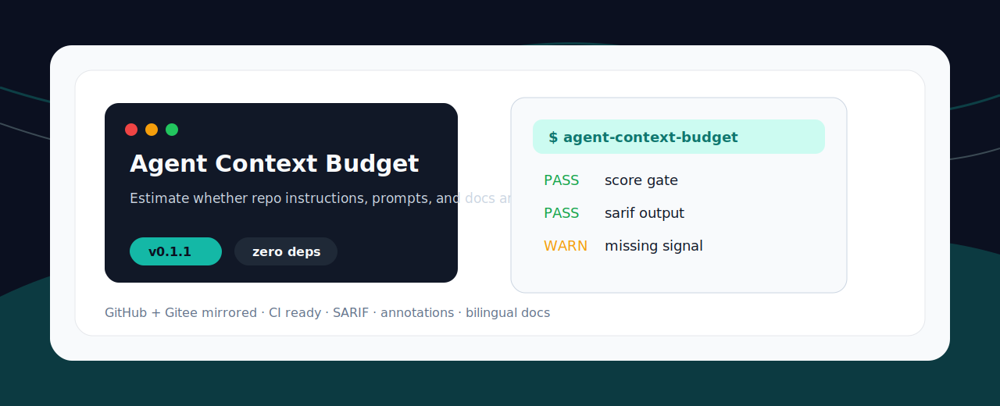

<p align="center">
  
</p>

<h1 align="center">Agent Context Budget</h1>

<p align="center">估算仓库说明、prompt 和文档是否适合 AI 编程 Agent 放进上下文。</p>

<p align="center"><a href="README.md">English</a> · <a href="#快速开始">快速开始</a> · <a href="#检查项">检查项</a></p>

<p align="center">
  
  
  
</p>

## 为什么做这个

AI Agent 工具链正在快速增长，但很多仓库缺少能直接放进 CI 或本地预检的小工具。这个项目保持零依赖、命令短、输出清楚，适合被收藏、fork、二次改造。

## 快速开始

```bash
npx github:aolingge/agent-context-budget --path AGENTS.md
```

Generate Markdown:

```bash
npx github:aolingge/agent-context-budget --path AGENTS.md --markdown > report.md
```

Use a score gate:

```bash
npx github:aolingge/agent-context-budget --path AGENTS.md --min-score 80
```

## 检查项

| Check | What it looks for |
| --- | --- |
| has-purpose | Explains why this file belongs in agent context. |
| has-commands | Contains concrete commands. |
| has-boundary | Defines what should not be loaded or edited. |
| has-summary | Provides a compact summary. |

## Output

```text
Agent Context Budget score: 100/100
PASS  example-check  Useful signal found
FAIL  missing-check  Add the missing guidance
```

## 参与贡献

Good first PRs: add checks, add fixtures, improve docs, or add GitHub Actions examples.

## License

MIT
